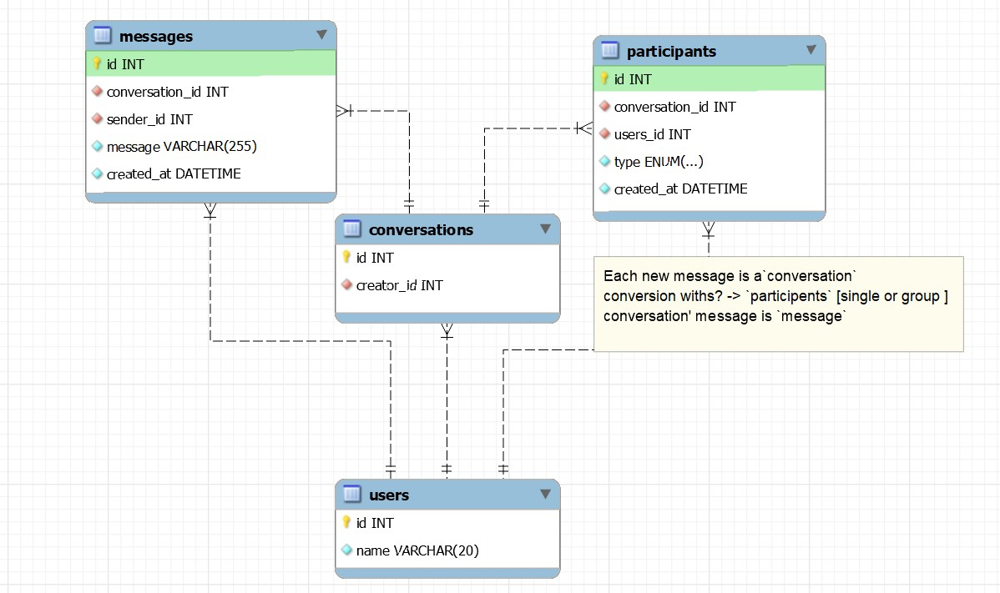

# Messenger

Messenger Database Design Concept for chat applications, by using this, you will be able to create group chat or a  one to one chat application without a hassle.

If you really like it? use it, implement it and share the link with me ;) Happy Messaging!

## Mini-version

> No need to maintain a `friendList` table as any send massages to anyone in Messenger.